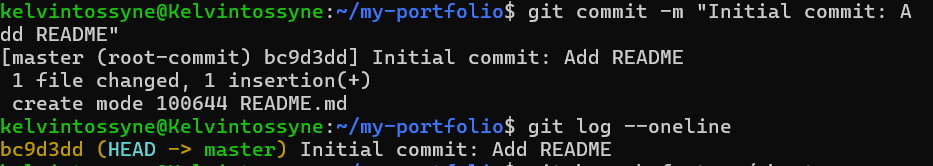
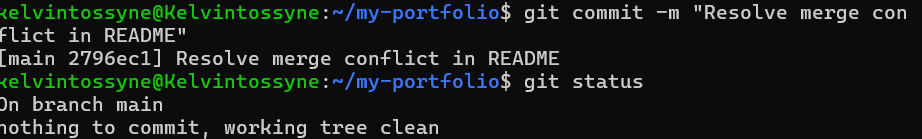
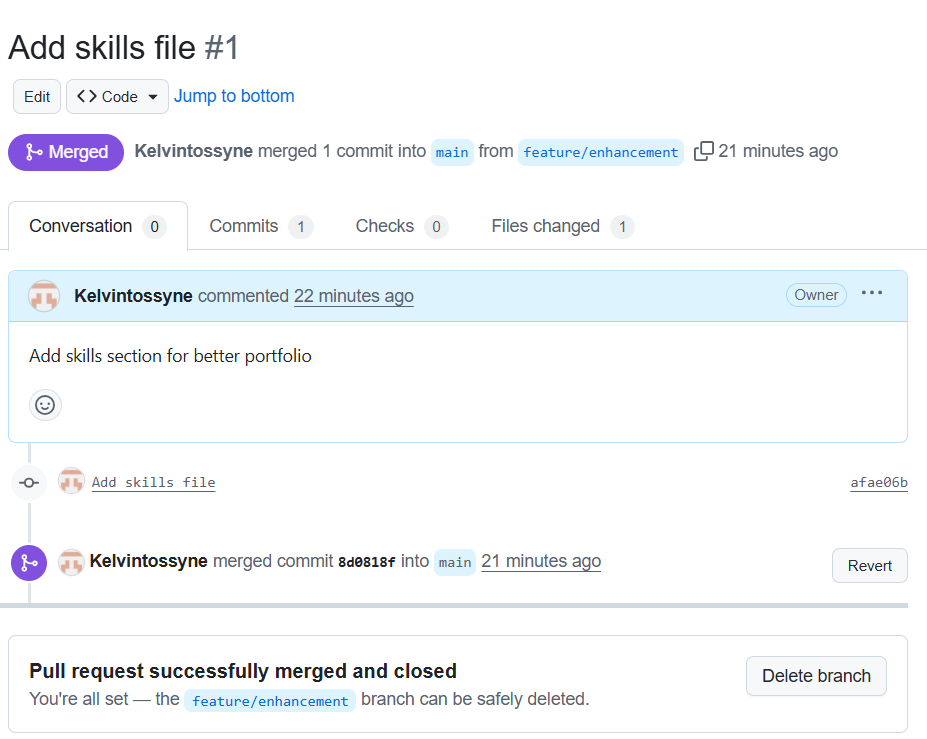

# Lab Report: Building a Collaborative Portfolio Repository

**Student:** Yusuf Oluwatosin Kelvin  
**GitHub Repo URL:** https://github.com/Kelvintossyne/my-portfolio.git  
**Date:** 19/Dec/2025

---

## 1. Screenshots from Checkpoints

### a) Initial Commit

### b) Merge Conflict Resolution

### c) Pull Request on GitHub

---

## 2. Reflection

**Challenges faced:**  
- Resolving merge conflicts between `main` and feature branches.  
- Understanding the correct order for branching and merging.  
- Authenticating with GitHub (password authentication was deprecated, needed token setup).  
- Adding screenshots

**How Git helps in DevOps teams:**  
- Provides version control for tracking changes safely.  
- Allows multiple team members to work on features simultaneously via branches.  
- Makes collaboration structured with pull requests and code reviews.  
- Reduces risk of overwriting changes and simplifies conflict resolution.

---

## 3. Issues Faced and Resolutions

| Issue | Resolution |

| Merge conflict when updating README.md | Manually edited conflict markers and committed the resolution. |
| GitHub password authentication failed | Generated a personal access token and used it instead of password. |
| Confusion with branch names | Used `git branch` and `git checkout -b` to verify and create correct branches. |

---

**End of Lab Report**

